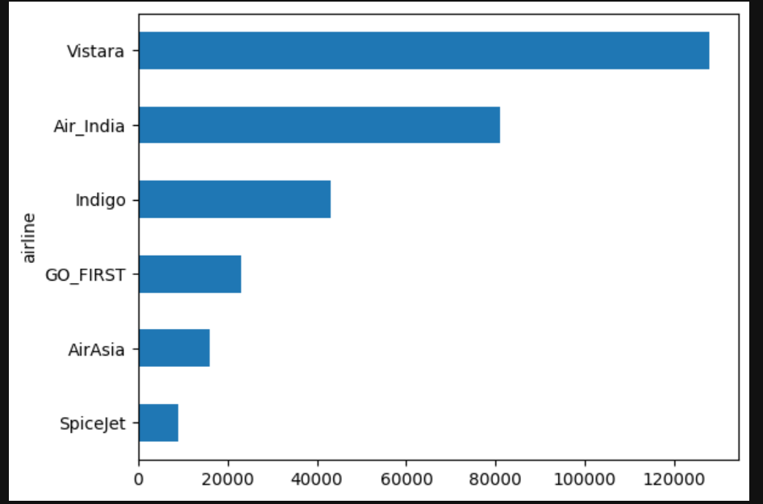
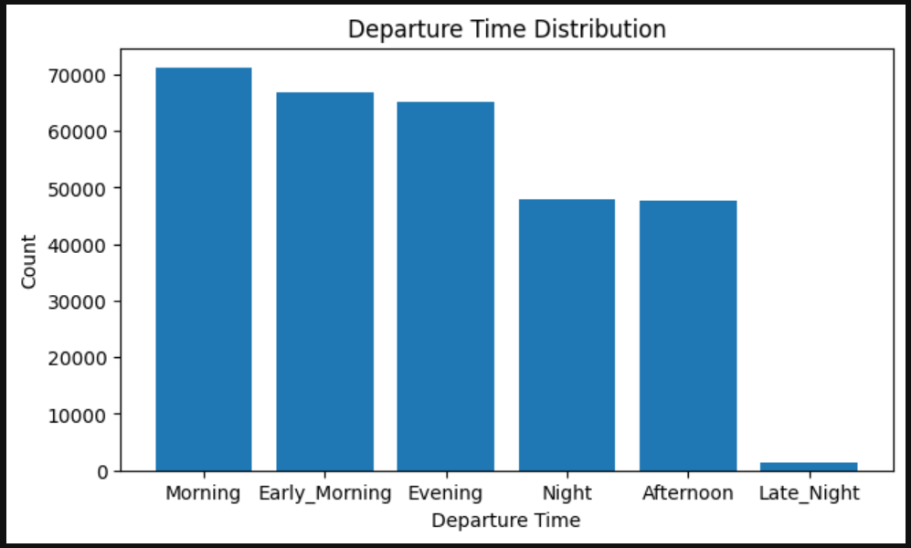
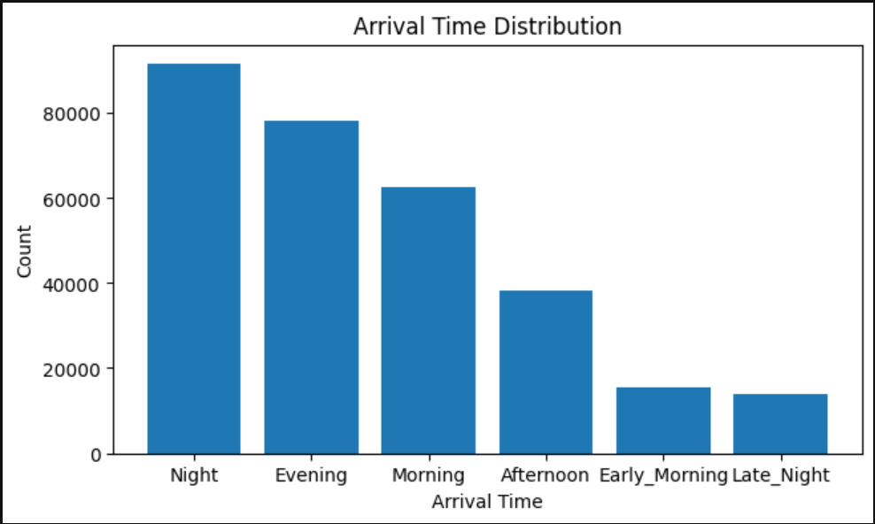
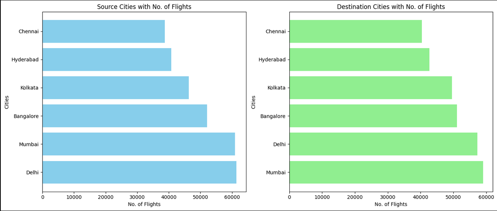
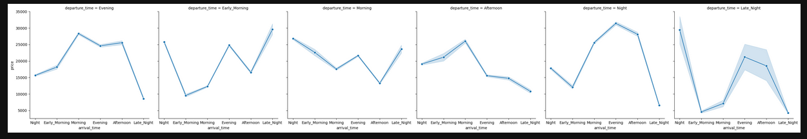
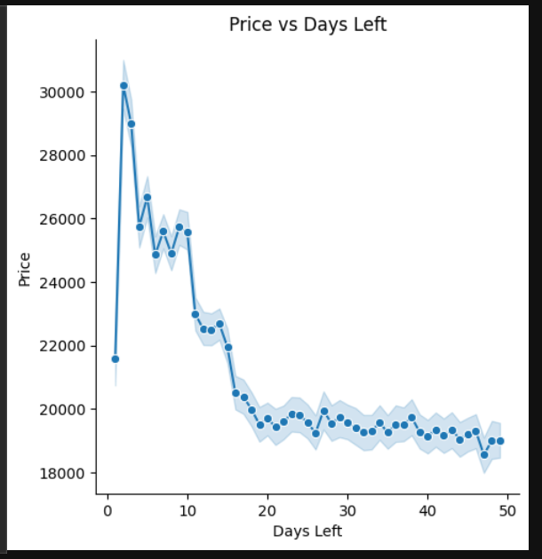

# Flight Data Analytics Project

## Overview
This project analyzes flight data to gain insights into airline pricing, departure and arrival trends, source and destination city statistics, and other key patterns. The project is implemented using **Python** and popular data analysis libraries like **Pandas, Matplotlib, and Seaborn**.

---

## Features
- **Airline Analysis:** Count and visualize flights per airline.  
- **Departure & Arrival Analysis:** Analyze flights by departure and arrival times.  
- **Source & Destination Cities:** Visualize the number of flights from each city.  
- **Price Analysis:** Explore flight prices over days left until departure.  
- **Interactive Visualizations:** Bar charts, horizontal bar charts, and line plots for clear insights.

---

## Technologies & Libraries
- Python 3.x  
- Pandas  
- Matplotlib  
- Seaborn  
- Jupyter Notebook (for development & visualization)

---

## Installation
1. Clone the repository:
   ```bash
   git clone https://github.com/yourusername/Flight-Data-Analytics.git

2. Navigate to the project folde
   ```bash
   cd Flight-Data-Analytics
3. Install required libraries
   ```bash
   pip install pandas matplotlib seaborn
4. Open the Jupyter Notebook
   ```bash
   jupyter notebook

## How to Use

Load the flight dataset (data.csv) into the project folder.
Run the Jupyter Notebook cells step by step to see the analysis and visualizations.
Modify plots or analysis as needed for further insights

## Images(data analysing)






